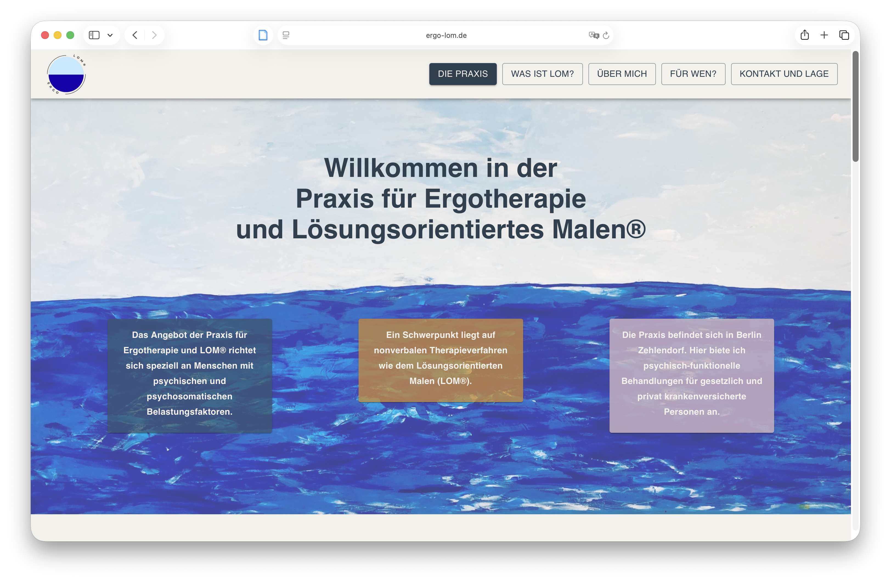

# Praxis für Ergotherapie & Lösungsorientiertes Malen®

A modern, responsive website for a occupational therapy practice in Berlin-Zehlendorf, with a focus on **Ergotherapie** and **Lösungsorientiertes Malen (LOM®)**.

[](https://www.ergo-lom.de)

<p align="center">
  <a href="https://www.ergo-lom.de"><strong>Visit the live website →</strong></a>
</p>

## About the website

The website presents the practice, its therapeutic approach and the services offered to people experiencing psychological or psychosomatic stress. It was designed to provide a calm, clear and accessible introduction to the practice while making important information easy to find.

### Main sections

- Introduction to the practice
- Information about Lösungsorientiertes Malen (LOM®)
- Information about the therapist and professional background
- Information for patients and referring professionals
- Contact and practice details

## Features

- Responsive layout for desktop and mobile devices
- Clear single-page navigation
- Image-based presentation of the practice and therapy approach
- Structured information sections
- Direct access to contact information
- Deployed production website with a custom domain

## Tech Stack

- **React** — component-based frontend
- **Vite** — development and build tooling
- **JavaScript / JSX**
- **HTML & CSS**

## Run locally

Clone the repository and install the dependencies:

```bash
git clone https://github.com/LeopoldNeuling/LOM.git
cd LOM
npm install
npm run dev
```
